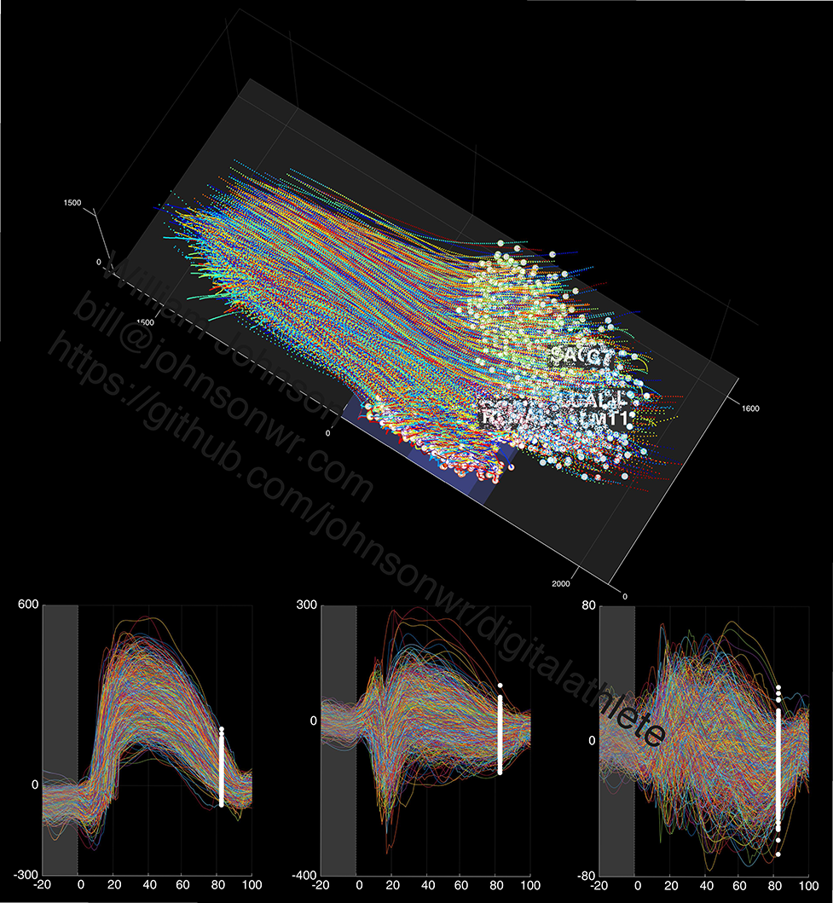

<!---
  ---
  --- 1. Filename, Creation-Date
  ---      digitalathlete/README.md, 22may2018
  ---
  --- 2. Original-Author, Email-Address
  ---      Copyright (c) MMXVIII
  ---      William JOHNSON, bill@johnsonwr.com
  ---
  --- 3. Last-Updated-By, Email-Address
  ---      William JOHNSON, bill@johnsonwr.com
  ---
  --- 4. Notes
  ---      GitHub index to supplementary publication material (models, animations, figures, presentations)
  ---      URL target="_blank" doesn't seem to be supported
  ---
  ---      http://digitalathlete.org
  ---      https://github.com/johnsonwr/digitalathlete
  ---
  ---      https://guides.github.com/features/mastering-markdown/
  ---      https://github.com/adam-p/markdown-here/wiki/Markdown-Cheatsheet
  ---
  ---      &#183; middle dot (LaTeX \cdot)
  ---
  --- 5. Modification-History
  ---      Build Author Date      Change
  ---      a36   wrj    27jun2018 alpha release
  --->

<h2>Deep learning workbench for biomechanics<br>http://digitalathlete.org</h2>
<table cellpadding=0 cellspacing=0>
<tr><td width=50%>
<i>Machine learning driven by wearable sensors brings laboratory-class biomechanical accuracy and validity to the sports field.</i><br><br>
By taking a new approach and training convolutional neural networks (CNNs) with archived biomechanics data, we are creating deep learning models to facilitate accurate multidimensional on-field predictive analytics. Using test sets from multi data-captures which include ground truth force plate and/or source modelling, we see strong correspondence between measured versus predicted ground reaction forces and moments, and knee joint moments, from markers (GRF/M r>0.97, KJM r>0.88, both 8 markers, 33% stance, sidestepping). Currently, we are investigating novel methods to build models for predicting GRF/M from wearable sensors (r>0.88, 4 accelerometers, 100% stance, sidestepping).<br><br>
William Johnson 
<a href="http://www.bristol.ac.uk/engineering/interdisciplinary/cse">BEngHons</a>, 
<a href="http://www.ecu.edu.au/degrees/courses/master-of-exercise-science-strength-and-conditioning">MExerSc</a>, 
<a href="https://www.engineersaustralia.org.au/Membership/Chartered">CPEng</a>, 
<a href="https://www.nsca.com/certification/cscs">CSCS</a><br>

bill@johnsonwr.com<br>
September 2018<br>
<a href="https://signal.org" title="Signal"></a>
<a href="https://www.researchgate.net/profile/William_Johnson54" title="ResearchGate"></a>
<a href="https://www.linkedin.com/in/johnsonwr" title="LinkedIn"></a>
<a href="https://twitter.com/billjohnsonuwa" title="Twitter"></a>
<a href="https://github.com/johnsonwr" title="GitHub"></a>
<a href="https://developer.nvidia.com/academic_gpu_seeding" title="NVIDIA"></a>
</td><td></td></tr>
<tr><td colspan=2>
Caution, model files are large, you may not wish to pull the complete repository. GitHub limits file sizes to 100MB, files larger than this have been broken up using <a href="http://manpages.ubuntu.com/manpages/trusty/man1/split.1.html"><b>split</b></a>. Instructions to reconstitute files are given inline.<br>
</td></tr>
</table>

<br>
<h3>Study four: Multidimensional knee joint moments from wearable sensor accelerations via deep learning</h3>
<table>
<tr><th align="left">Keywords</th><td align="left">Biomechanics &#183; Wearable sensors &#183; Synthetic accelerations &#183; Motion capture &#183; Sports analytics</td></tr>
<tr><th align="left">Paper</th><td align="left"><i>In preparation</i><br></td></tr>
<tr><th align="left"><a href="http://wcb2018.com">WCB 2018</a><br>conference</th><td align="left">
<b>Multidimensional ground reaction forces and moments from wearable sensor accelerations via deep learning</b><br>
Abstract http://bit.ly/2GzYnHD<br>
Presentation with commentary http://bit.ly/2tCKHTo<br>
</td></tr>
</table><br>

<br>
<h3>Study three: On-field player workload exposure and knee injury risk monitoring via deep learning</h3>
<table>
<tr><th align="left">Keywords</th><td align="left">Biomechanics &#183; Wearable sensors &#183; Computer vision &#183; Motion capture &#183; Sports analytics</td></tr>
<tr><th align="left"><a href="https://arxiv.org">arXiv</a><br>paper</th><td align="left">https://arxiv.org/abs/1809.08016</td></tr>
<tr><th align="left">Presentation</th><td align="left">http://bit.ly/2HS7HCv</td></tr>
<tr><th align="left">Animation</th><td align="left">Training set marker trajectories versus corresponding knee joint moments visualization<br>(supplementary figure) http://bit.ly/2yTaX1f</td></tr>
<tr><th align="left">MATLAB figures</th><td align="left">https://github.com/johnsonwr/digitalathlete/tree/master/study3/figures</td></tr>
<tr><th align="left">Caffe models</th><td align="left">https://github.com/johnsonwr/digitalathlete/tree/master/study3/models (1.3GB)<br><br>

```
cat grftrain_180613080625130_mcrnet.caffemodel_j01_* > grftrain_180613080625130_mcrnet.caffemodel_j01 # reconstitute Caffe model 1
```

</td></tr>
<tr><th align="left">Prototxt</th><td align="left">https://github.com/johnsonwr/digitalathlete/tree/master/study3/prototxt</td></tr>
</table><br>

<br>
<h3>Study two: Predicting athlete ground reaction forces and moments from spatio-temporal driven CNN models</h3>
<table>
<tr><th align="left">Keywords</th><td align="left">Biomechanics &#183; Supervised learning &#183; Image motion analysis &#183; Computer simulation</td></tr>
<tr><th align="left"><a href="http://ieeexplore.ieee.org/xpl/RecentIssue.jsp?punumber=10">IEEE TBME</a><br>paper</th><td align="left">https://ieeexplore.ieee.org/document/8408711</td></tr>
<tr><th align="left">Animation</th><td align="left">Training set marker trajectories versus corresponding ground reaction forces and moments visualization<br>(supplementary figure) http://bit.ly/2Is3PJx</td></tr>
<tr><th align="left">MATLAB figures</th><td align="left">https://github.com/johnsonwr/digitalathlete/tree/master/study2/figures</td></tr>
<tr><th align="left">Caffe models</th><td align="left">https://github.com/johnsonwr/digitalathlete/tree/master/study2/models (1.3GB)<br><br>

```
cat grftrain_180505092408060_mcrnet.caffemodel_j01_* > grftrain_180505092408060_mcrnet.caffemodel_j01 # reconstitute Caffe model 1
```

</td></tr>
<tr><th align="left">Prototxt</th><td align="left">https://github.com/johnsonwr/digitalathlete/tree/master/study2/prototxt</td></tr>
<tr><th align="left">CaffeNet reference</th><td align="left">https://github.com/BVLC/caffe/tree/master/models/bvlc_reference_caffenet</td></tr>
<tr><th align="left"><a href="http://www.isbs2017.com">ISBS 2017</a><br>conference</th><td align="left"><b>Prediction of ground reaction forces and moments via supervised learning is independent of participant sex, height and mass</b><br>
Abstract https://commons.nmu.edu/cgi/viewcontent.cgi?&article=1034&context=isbs<br>
Presentation http://bit.ly/2MvqW8c
</td></tr>
</table><br>

<br>
<h3>Study one: Predicting athlete ground reaction forces and moments from motion capture</h3>
<table>
<tr><th align="left">Keywords</th><td align="left">Action recognition &#183; Wearable sensors &#183; Computer simulation</td></tr>
<tr><th align="left"><a href="http://link.springer.com/journal/11517">MBEC</a><br>paper</th><td align="left">https://link.springer.com/article/10.1007/s11517-018-1802-7</td></tr>
<tr><th align="left">Presentation with commentary</th><td align="left">http://bit.ly/2kcgXrw</td></tr>
<tr><th align="left">MATLAB figures</th><td align="left">https://github.com/johnsonwr/digitalathlete/tree/master/study1/figures</td></tr>
<tr><th align="left">R models</th><td align="left">https://github.com/johnsonwr/digitalathlete/tree/master/study1/models (1.9GB)<br><br>
  
```
cat grftrain_171214215406095_R_predict_model_* > grftrain_171214215406095_R_predict_model.Rda # reconstitute R model
```
  
</td></tr>
<tr><th align="left">R SPLS reference</th><td align="left">https://cran.r-project.org/web/packages/spls/index.html</td></tr>
</table><br>

<!--- end>
