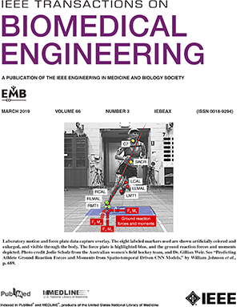

<!---
  ---
  --- 1. Filename, Creation-Date
  ---      digitalathlete/README.md, 22may2018
  ---
  --- 2. Original-Author, Email-Address
  ---      Copyright (c) MMXX
  ---      William JOHNSON, bill@johnsonwr.com
  ---
  --- 3. Last-Updated-By, Email-Address
  ---      William JOHNSON, bill@johnsonwr.com
  ---
  --- 4. Notes
  ---      GitHub index to supplementary publication material (models, animations, figures, presentations)
  ---      URL target="_blank" doesn't seem to be supported
  ---
  ---      http://digitalathlete.org
  ---      https://github.com/johnsonwr/digitalathlete
  ---
  ---      https://guides.github.com/features/mastering-markdown/
  ---      https://github.com/adam-p/markdown-here/wiki/Markdown-Cheatsheet
  ---      https://stackoverflow.com/questions/4823468/comments-in-markdown
  ---      https://en.wikipedia.org/wiki/List_of_XML_and_HTML_character_entity_references
  ---
  ---      &#183; middle dot (LaTeX \cdot)
  ---      &#233; eacute
  ---
  ---      190218 Earlier:
  ---      Machine learning driven by wearable sensors brings laboratory-class biomechanical accuracy and validity to the sports field for the first time.
  ---      Machine learning driven by wearable sensors can replace laboratory instrumentation to bring biomechanical accuracy and validity to the sports field for the first time.
  ---      190218:
  ---      Machine learning driven by wearable sensors can replace laboratory instrumentation and bring biomechanical accuracy and validity to the sports field.
  ---      By taking a new approach and training convolutional neural networks (CNNs) with archived biomechanics data, we are creating deep learning models to facilitate accurate multidimensional on-field predictive analytics.
  ---      Using test sets from multi data-captures which include ground truth force plate and/or source modelling, we see strong correspondence between measured versus predicted ground reaction forces and moments, and knee joint moments, from markers (GRF/M r>0.97, KJM r>0.88, both 8 markers, 33% stance, sidestepping).
  ---      Currently, we are investigating novel methods to build models for predicting GRF/M from wearable sensors (r>0.88, 4 accelerometers, 100% stance, sidestepping).
  ---      190302:
  ---      Deep learning models driven by wearable sensor accelerometers can replace laboratory instrumentation and bring biomechanical accuracy and validity to the sports field.
  ---      By taking a new approach and training convolutional neural networks (CNN) with archive biomechanics data, we facilitate accurate multidimensional on-field predictive analytics for complex sport movements. 
  ---      Using test sets from multi data-captures which include ground truth force plate or source modeling, we see strong correspondence between measured versus predicted ground reaction forces and moments, and knee joint moments. 
  ---      From eight markers, study two GRF/M mean r>0.97, study three KJM mean r>0.88, and from five wearable sensor accelerometers, study four GRF mean r>0.87. 
  ---
  --- 5. Modification-History
  ---      Build Author Date      Release
  ---      a**   wrj    31dec2019 alpha (untracked)
  --->

<!--- ---------+---------+---------+---------+---------+---------+---------+---------+---------+---------+ --->
<!--- 200501 Introduction --->
<!--- <a href="https://www.bristol.ac.uk/study/undergraduate/2021/electrical-electronic-eng/beng-computer-science-and-electronics">BEngHons</a> --->
<!--- - was <a href="http://www.bristol.ac.uk/engineering/interdisciplinary/cse">BEngHons</a> --->
<!--- <a href="http://www.ecu.edu.au/degrees/courses/master-of-exercise-science-strength-and-conditioning">MExerSc</a> --->
<!--- <a href="https://www.engineersaustralia.org.au/Membership/Chartered">CPEng</a> --->
<!--- ---------+---------+---------+---------+---------+---------+---------+---------+---------+---------+ --->
<h2>Non-invasive estimation of ground and joint kinetics through deep learning<br>http://digitalathlete.org</h2>
<table cellpadding=0 cellspacing=0>
<tr>
<td width=50%>
<i>Deep learning models driven by wearable sensor accelerometers can replace captive laboratory instrumentation to facilitate biomechanical accuracy and validity anywhere</i><br><br>
By employing a new deep learning workbench for spatio-temporal data, we train convolutional neural networks (CNN) with archive biomechanics data to predict accurate multidimensional on-field analytics for complex sports movements. 
Using test sets from multi data-captures which include ground truth force plate or source modeling, we see strong correspondence between measured versus predicted ground reaction forces and moments, and knee joint moments. 
Driven by eight markers, study two GRF/M mean r>0.97, study three KJM mean r>0.88, and from five wearable sensor accelerometers, study four GRF mean r>0.87. 
The overarching hypothesis, whether it is possible to build deep learning models which can mimic the physics behind human movement, specifically to replace force plate derived kinetic output, is supported.
<br><br>
William R. Johnson 
<a href="https://www.uwa.edu.au/science/schools/school-of-human-sciences">PhD</a> 
<a href="https://www.engineersaustralia.org.au/chartered">CPEng</a> 
<a href="https://www.nsca.com/certification/cscs">CSCS</a> (he/him/his)
<br><a href="mailto:bill@johnsonwr.com">bill@johnsonwr.com</a> | July 2021<br>
<a href="http://cv.billjohnson.org">cv.billjohnson.org</a> | <a href="http://videocv.billjohnson.org">videocv.billjohnson.org</a><br>
<a href="https://www.linkedin.com/in/johnsonwr" title="LinkedIn"></a>
<a href="https://www.researchgate.net/profile/William_Johnson54" title="ResearchGate"></a>
<a href="https://scholar.google.com.au/citations?user=DwbHHFkAAAAJ&hl=en" title="Google Scholar"></a>
<a href="http://www2.c-motion.com/products/visual3d" title="C-Motion"></a>
<a href="https://developer.nvidia.com/academic_gpu_seeding" title="NVIDIA"></a>
</td>

<td></td></tr>
<tr><td colspan=2>
Caution, model files are large, you may not wish to pull the complete repository. 
GitHub limits file sizes to 100MB, files larger than this have been broken up using <a href="http://manpages.ubuntu.com/manpages/trusty/man1/split.1.html"><b>split</b></a>. 
Instructions to reconstitute files are given inline.<br>
</td></tr>
</table><br><br>

<!--- ---------+---------+---------+---------+---------+---------+---------+---------+---------+---------+ --->
<!--- 210714 Post-doc --->
<!--- ---------+---------+---------+---------+---------+---------+---------+---------+---------+---------+ --->
<h3>Post-doc: A comparison of three neural network approaches for estimating joint angles and moments from inertial measurement units</h3>
<table>
<tr><th align="left"><a href="https://www.mdpi.com/journal/sensors/special_issues/Sensors_in_Sports_Biomechanics">Sensors</a></th>
</th><td align="left">https://www.mdpi.com/1424-8220/21/13/4535/pdf <style="font-size:6px">(12)</td></tr>
</td></tr>
</table><br><br>

<!--- ---------+---------+---------+---------+---------+---------+---------+---------+---------+---------+ --->
<!--- 201124 Doctoral thesis --->
<!--- ---------+---------+---------+---------+---------+---------+---------+---------+---------+---------+ --->
<h3>Doctoral thesis: Non-invasive estimation of ground and joint kinetics through deep learning</h3>
<table>
<tr><th align="left"><a href="https://www.uwa.edu.au/science/schools/school-of-human-sciences">The University<br>of Western Australia</a></th>
</th><td align="left">https://research-repository.uwa.edu.au/en/publications/non-invasive-estimation-of-ground-and-joint-kinetics-through-deep</td></tr>
</td></tr>
</table><br><br>

<!--- ---------+---------+---------+---------+---------+---------+---------+---------+---------+---------+ --->
<!--- 190319 Study four --->
<!--- ---------+---------+---------+---------+---------+---------+---------+---------+---------+---------+ --->
<h3>Study four: Multidimensional ground reaction forces and moments from wearable sensor accelerations via deep learning</h3>
<table>
<tr><th align="left">Keywords</th><td align="left">Biomechanics &#183; Wearable sensors &#183; Simulated accelerations &#183; Workload exposure &#183; Sports analytics &#183; Deep learning</td></tr>
<tr><th align="left"><a href="https://ieeexplore.ieee.org/xpl/mostRecentIssue.jsp?punumber=10">IEEE TBME</a></th><td align="left">https://ieeexplore.ieee.org/document/9130158</td></tr>
<tr><th align="left"><a href="https://arxiv.org">arXiv</a></th><td align="left">https://arxiv.org/abs/1903.07221</td></tr>
<tr><th align="left"><a href="https://isb2019.com">ISB2019</a> (<a href="https://isbweb.org">ISB</a>/<a href="https://asbweb.org">ASB</a>)</th><td align="left">
<b>Multidimensional ground reaction forces predicted from a single sacrum-mounted accelerometer via deep learning</b><br>
Abstract http://bit.ly/2M9j3rw<br>
Presentation http://bit.ly/2SHcsYv<br>
</td></tr>
<tr><th align="left"><a href="https://www.eventbrite.com.au/e/engineering-and-mathematical-sciences-hdr-conference-2018-tickets-51052347947">EMS HDR Conference 2018</a></th><td align="left">
Poster (Conference Award) http://bit.ly/2yXgdgO<br>
</td></tr>
<tr><th align="left"><a href="http://wcb2018.com">WCB2018</a></th><td align="left">
Abstract (Student Bursary Award) http://bit.ly/2GzYnHD<br>
Presentation with commentary http://bit.ly/2tCKHTo<br>
</td></tr>
<tr><th align="left">MATLAB figures</th><td align="left">https://github.com/johnsonwr/digitalathlete/tree/master/study4/figures</td></tr>
<tr><th align="left">Caffe models</th><td align="left">https://github.com/johnsonwr/digitalathlete/tree/master/study4/models (637MB)

```
cat grftrain_181112104456175_mcrnet.caffemodel_* > grftrain_181112104456175_mcrnet.caffemodel # reconstitute CaffeNet donor seed model
cat grftrain_181123170749181_mcrnet.caffemodel_* > grftrain_181123170749181_mcrnet.caffemodel # reconstitute CaffeNet model
```

</td></tr>
<tr><th align="left">Prototxt</th><td align="left">https://github.com/johnsonwr/digitalathlete/tree/master/study4/prototxt</td></tr>
</table><br><br>

<!--- ---------+---------+---------+---------+---------+---------+---------+---------+---------+---------+ --->
<!--- 190711 Study three --->
<!--- ---------+---------+---------+---------+---------+---------+---------+---------+---------+---------+ --->
<h3>Study three: On-field player workload exposure and knee injury risk monitoring via deep learning</h3>
<table>
<tr><th align="left">Keywords</th><td align="left">Biomechanics &#183; Wearable sensors &#183; Computer vision &#183; Motion capture &#183; Sports analytics</td></tr>
<tr><th align="left"><a href="https://www.sciencedirect.com/journal/journal-of-biomechanics">Journal of Biomechanics</a></th><td align="left">https://www.sciencedirect.com/science/article/abs/pii/S0021929019304427</td></tr>
<tr><th align="left"><a href="https://arxiv.org">arXiv</a></th><td align="left">https://arxiv.org/abs/1809.08016</td></tr>
<tr><th align="left"><a href="https://isb2019.com">ISB2019</a> (<a href="https://isbweb.org">ISB</a>/<a href="https://asbweb.org">ASB</a>)</th><td align="left">
<b>Predicting ground and joint kinetics from wearable sensor accelerations via deep learning</b><br>
Abstract http://bit.ly/2y7mZ3A<br>
Presentation (panel) http://bit.ly/2rIh2uo<br>
</td></tr>
<tr><th align="left">Presentation</th><td align="left">http://bit.ly/2HS7HCv</td></tr>
<tr><th align="left">Animation</th><td align="left">Training set marker trajectories versus corresponding knee joint moments visualization<br>(supplementary figure) http://bit.ly/2yTaX1f</td></tr>
<tr><th align="left">MATLAB figures</th><td align="left">https://github.com/johnsonwr/digitalathlete/tree/master/study3/figures</td></tr>
<tr><th align="left">Caffe models</th><td align="left">https://github.com/johnsonwr/digitalathlete/tree/master/study3/models (2.6GB)<br><br>

```
cat grftrain_180612214018112_mcrnet.caffemodel_j01_* > grftrain_180612214018112_mcrnet.caffemodel_j01 # reconstitute CaffeNet donor seed model 01
cat grftrain_190215144249130_mcrnet.caffemodel_j01_* > grftrain_190215144249130_mcrnet.caffemodel_j01 # reconstitute CaffeNet model 01
```

</td></tr>
<tr><th align="left">Caffe prototxt</th><td align="left">https://github.com/johnsonwr/digitalathlete/tree/master/study3/prototxt</td></tr>
</table><br><br>

<!--- ---------+---------+---------+---------+---------+---------+---------+---------+---------+---------+ --->
<!--- 190303 Study two --->
<!--- ---------+---------+---------+---------+---------+---------+---------+---------+---------+---------+ --->
<h3>Study two: Predicting athlete ground reaction forces and moments from spatio-temporal driven CNN models</h3>
<table cellpadding=0 cellspacing=0>
<tr><th align="left">Keywords</th><td width=450 align="left">Biomechanics &#183; Supervised learning &#183; Image motion analysis &#183; Computer simulation &#183; Pattern analysis</td><td rowspan=3><a href="https://ieeexplore.ieee.org/xpl/tocresult.jsp?isnumber=8643653" title="Cover"></a></td></tr>
<tr><th align="left"><a href="https://ieeexplore.ieee.org/xpl/mostRecentIssue.jsp?punumber=10">IEEE TBME</a></th>
<td align="left">
Paper https://ieeexplore.ieee.org/document/8408711<br>
Feature https://tbme.embs.org/2019/03/01/predicting-athlete-ground-reaction-forces-and-moments-from-spatio-temporal-driven-cnn-models</td></tr>
<tr><th align="left">Animation</th>
<td align="left">Training set marker trajectories versus corresponding ground reaction forces and moments visualization<br>(supplementary figure) http://bit.ly/2Is3PJx</td></tr>
<tr><th align="left"><a href="https://www.uwa.edu.au/ems/schools/physics-mathematics-and-computing/department-of-computer-science-and-software-engineering">UWA CSSE</a> Conference 2017</th>
<td align="left" colspan=2><b>Relative performance of Caffe deep learning models for spatio-temporal sport analytics</b><br>Presentation http://bit.ly/2TCWqwM</td></tr>
<tr><th align="left">MATLAB figures</th><td align="left" colspan=2>https://github.com/johnsonwr/digitalathlete/tree/master/study2/figures</td></tr>
<tr><th align="left">Caffe models</th><td align="left" colspan=2>https://github.com/johnsonwr/digitalathlete/tree/master/study2/models (1.3GB)<br><br>

```
cat grftrain_190215204017060_mcrnet.caffemodel_j01_* > grftrain_190215204017060_mcrnet.caffemodel_j01 # reconstitute CaffeNet model 01
```

</td></tr>
<tr><th align="left">Caffe prototxt</th><td align="left" colspan=2>https://github.com/johnsonwr/digitalathlete/tree/master/study2/prototxt</td></tr>
<tr><th align="left">CaffeNet reference</th><td align="left" colspan=2>https://github.com/BVLC/caffe/tree/master/models/bvlc_reference_caffenet</td></tr>
<tr><th align="left"><a href="http://www.isbs2017.com">ISBS2017</a> (<a href="https://isbs.org">ISBS</a>)</th><td align="left" colspan=2><b>Prediction of ground reaction forces and moments via supervised learning is independent of participant sex, height and mass</b><br>
Abstract (Student Travel Grant) https://commons.nmu.edu/cgi/viewcontent.cgi?&article=1034&context=isbs<br>
Presentation http://bit.ly/2MvqW8c</td></tr>
</table><br><br>

<!--- ---------+---------+---------+---------+---------+---------+---------+---------+---------+---------+ --->
<!--- 190303 Study one --->
<!--- ---------+---------+---------+---------+---------+---------+---------+---------+---------+---------+ --->
<h3>Study one: Predicting athlete ground reaction forces and moments from motion capture</h3>
<table>
<tr><th align="left">Keywords</th><td align="left">Action recognition &#183; Wearable sensors &#183; Computer simulation</td></tr>
<tr><th align="left"><a href="http://link.springer.com/journal/11517">MBEC</a></th><td align="left">https://link.springer.com/article/10.1007/s11517-018-1802-7</td></tr>
<tr><th align="left"><a href="https://www.uwa.edu.au/ems/schools/physics-mathematics-and-computing/department-of-computer-science-and-software-engineering">UWA CSSE</a> Conference 2016</th><td align="left">Presentation with commentary http://bit.ly/2kcgXrw</td></tr>
<tr><th align="left">MATLAB figures</th><td align="left">https://github.com/johnsonwr/digitalathlete/tree/master/study1/figures</td></tr>
<tr><th align="left">R models</th><td align="left">https://github.com/johnsonwr/digitalathlete/tree/master/study1/models (1.9GB)<br><br>
  
```
cat grftrain_171214215406095_R_predict_model_* > grftrain_171214215406095_R_predict_model.Rda # reconstitute R model
```
  
</td></tr>
<tr><th align="left">R SPLS reference</th><td align="left">https://cran.r-project.org/web/packages/spls/index.html</td></tr>
</table><br><br>

<!--- ---------+---------+---------+---------+---------+---------+---------+---------+---------+---------+ --->
<!--- 200501 Machine Learning resources, courses, groups & books --->
<!--- ---------+---------+---------+---------+---------+---------+---------+---------+---------+---------+ --->
<h3>Machine Learning resources</h3>
<table>
<tr><th align="left"><a href="https://www.andrewng.org">Andrew Ng</a></th>
<td align="left"><b>Machine Learning course</b><br>
https://www.coursera.org/learn/machine-learning<br>
https://www.coursera.org/learn/ai-for-everyone<br>
http://cs229.stanford.edu<br>
http://www.mlyearning.org</td></tr>
<tr><th align="left"><a href="http://vision.stanford.edu/feifeili">Fei-Fei Li</a></th>
<td align="left"><b>Stanford Convolutional Neural Networks for Visual Recognition</b><br>
http://cs231n.stanford.edu<br>
http://cs231n.github.io</td></tr>
<tr><th align="left"><a href="http://www.iangoodfellow.com">Ian Goodfellow</a></th>
<td align="left"><b>Deep Learning</b><br>
http://www.deeplearningbook.org<br>
https://www.amazon.com/Deep-Learning-Adaptive-Computation-Machine/dp/0262035618</td></tr>
<tr><th align="left">Bill Lubanovic</th>
<td align="left"><b>Introducing Python</b><br>
https://www.amazon.com/Introducing-Python-Modern-Computing-Packages/dp/1449359361</td></tr>
<tr><th align="left"><a href="https://sebastianraschka.com">Sebastian Raschka</a></th>
<td align="left"><b>Python Machine Learning</b><br>
https://www.amazon.com/Python-Machine-Learning-scikit-learn-TensorFlow-ebook/dp/B0742K7HYF</td></tr>
<tr><th align="left"><a href="https://github.com/ageron">Aur&#233;lien G&#233;ron</a></th>
<td align="left"><b>Hands-On Machine Learning with Scikit-Learn & TensorFlow</b><br>
https://www.amazon.com/Hands-Machine-Learning-Scikit-Learn-TensorFlow-ebook/dp/B06XNKV5TS</td></tr>
<tr><th align="left"><a href="https://www.meetup.com/en-AU/Perth-Machine-Learning-Group/members/196687236">Sean Driver</a></th>
<td align="left"><b>Perth Machine Learning Group</b><br>
https://www.meetup.com/en-AU/Perth-Machine-Learning-Group<br>
https://github.com/pmlg/pmlg.github.io<br>
https://www.fast.ai</td></tr>
</table><br><br>

<!--- ---------+---------+---------+---------+---------+---------+---------+---------+---------+---------+ --->
<!--- 200501 Biomechanics resources, courses, groups & books --->
<!--- ---------+---------+---------+---------+---------+---------+---------+---------+---------+---------+ --->
<h3>Biomechanics resources</h3>
<table>
<tr><th align="left"><a href="https://www.uwa.edu.au/science/schools/school-of-human-sciences">The University<br>of Western Australia</a></th>
<td align="left"><b>Biomechanics courses</b><br>
<a href="https://handbooks.uwa.edu.au/unitdetails?code=SSEH2250">SSEH2250 Biomechanics in Sport and Exercise</a><br>
<a href="https://handbooks.uwa.edu.au/unitdetails?code=SSEH3355">SSEH3355 Biomechanical Principles</a><br>
<a href="https://handbooks.uwa.edu.au/unitdetails?code=SSEH4633">SSEH4633 Advanced Biomechanical Methods</a><br>
</td></tr>
<tr><th align="left">Roger Bartlett</th>
<td align="left"><b>Introduction to Sports Biomechanics</b><br>
https://www.amazon.com/Introduction-Sports-Biomechanics-Analysing-Movement/dp/0415632439</td></tr>
<tr><th align="left">Joseph Hamill<br>Kathleen Knutzen<br>Timothy Derrick</th>
<td align="left"><b>Biomechanical Basis of Human Movement</b><br>
https://www.amazon.com/Biomechanical-Basis-Movement-Joseph-Hamill/dp/1451177305</td></tr>
<tr><th align="left">Jim Richards</th>
<td align="left"><b>Biomechanics in Clinic and Research: An Interactive Teaching and Learning Course</b><br>
https://www.amazon.com/Comprehensive-Textbook-Clinical-Biomechanics-learning/dp/0702054895</td></tr>
<tr><th align="left">Carl Peyton<br>Adrian Burden</th>
<td align="left"><b>Biomechanical Evaluation of Movement in Sport and Exercise</b><br>
https://www.amazon.com/Biomechanical-Evaluation-Movement-Exercise-Science/dp/0415632668</td></tr>
<tr><th align="left">Youlian Hong<br>Roger Bartlett</th>
<td align="left"><b>Routledge Handbook of Biomechanics and Human Movement Science</b><br>
https://www.amazon.com/Routledge-Handbook-Biomechanics-International-Handbooks-ebook/dp/B001PC1ZX8</td></tr>
<tr><th align="left">David Winter</th>
<td align="left"><b>Biomechanics and Motor Control of Human Movement</b><br>
https://www.amazon.com/Biomechanics-Motor-Control-Human-Movement/dp/0470398183</td></tr>
<tr><th align="left">The Biomechanist</th>
<td align="left"><b>The Week in Biomechanics</b><br>
https://www.biomechanist.net/blog</td></tr>
<tr><th align="left">Biomch-L</th>
<td align="left"><b>Forum, sponsored by the International Society of Biomechanics (<a href="https://isbweb.org">ISB</a>)</b><br>
https://biomch-l.isbweb.org</td></tr>
<tr><th align="left">3-D Analysis of Human Movement</th>
<td align="left"><b>Technical Group of the International Society of Biomechanics (<a href="https://isbweb.org">ISB</a>)</b><br>
http://www.geocities.ws/3d-ahm</td></tr>
<tr><th align="left">Awesome Biomechanics</th>
<td align="left"><b>A curated repository of biomechanical resources</b><br>
https://github.com/modenaxe/awesome-biomechanics</td></tr>
</table><br><br>

<!--- ---------+---------+---------+---------+---------+---------+---------+---------+---------+---------+ --->
<!--- 190303 PhD supervisors --->
<!--- ---------+---------+---------+---------+---------+---------+---------+---------+---------+---------+ --->
<h3>PhD supervisors</h3>
<table>
<tr><th align="left">Jacqueline A. Alderson</th>
<td align="left">
<b>School of Human Sciences (Exercise and Sport Science), The University of Western Australia, Perth, Australia</b><br>
<b>Sports Performance Research Institute New Zealand (SPRINZ), Auckland University of Technology, Auckland, New Zealand</b><br>
https://research-repository.uwa.edu.au/en/persons/jacqueline-alderson
</td></tr>
<tr><th align="left">Ajmal Mian</th>
<td align="left">
<b>Department of Computer Science and Software Engineering, The University of Western Australia, Perth, Australia</b><br>
https://research-repository.uwa.edu.au/en/persons/ajmal-mian<br>
<b>Machine Intelligence Group</b><br>
https://www.youtube.com/channel/UCy-HDqRqdYS3UUiCIqqfFxQ/videos</td></tr>
<tr><th align="left">David G. Lloyd</th>
<td align="left">
<b>Menzies Health Institute Queensland, and the School of Allied Health Sciences, Griffith University, Gold Coast, Australia</b><br>
https://experts.griffith.edu.au/academic/david.lloyd
</td></tr>
</table><br><br>

<!--- ---------+---------+---------+---------+---------+---------+---------+---------+---------+---------+ --->
<!--- 200501 Acknowledgements --->
<!--- 200501 DP160101458 replaced by DP190102443 --->
<!--- ---------+---------+---------+---------+---------+---------+---------+---------+---------+---------+ --->
<h3>Acknowledgements</h3>
<table>
<tr><td align="left">
This project was partially supported by the 
<a href="https://www.arc.gov.au/">ARC Discovery Grant DP190102443</a> 
and an 
<a href="https://www.education.gov.au/research-training-program">Australian Government Research Training Program Scholarship</a>. 
<a href="https://developer.nvidia.com/academic_gpu_seeding">NVIDIA Corporation</a> 
is gratefully acknowledged for the GPU provision through its Hardware Grant Program, 
<a href="http://www.eigenvector.com/software/pls_toolbox.htm">Eigenvector Research</a> 
for the PLS_Toolbox licence, and 
<a href="http://www2.c-motion.com/products/visual3d">C-Motion Inc.</a> 
for the Visual3D licence. Portions of data included in this study were funded by 
<a href="https://nhmrc.gov.au/funding">NHMRC grant 400937</a>.
</td></tr>
</table><br><br>

<!--- end --->
